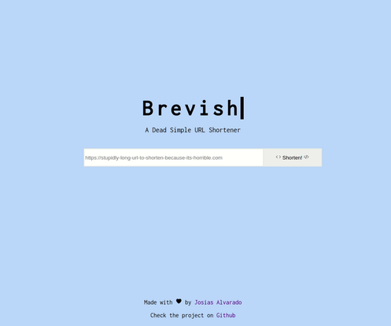

# Brevish | A Dead Simple URL Shortener

Brevish is a simple URL shortener written in Python using the Flask Web Framework.

## Built With
- Python & Flask
- HTML & CSS

## Live Demo

[Live Demo Link](https://brevish.herokuapp.com/)

## Author

**Josias Alvarado**

- GitHub: [@pointerish](https://github.com/pointerish)
- Twitter: [@pointerish](https://twitter.com/pointerish)
- LinkedIn: [Josias Alvarado](https://www.linkedin.com/in/josias-alvarado-80901878/)

##  Contributing

Contributions, issues, and feature requests are welcome!

## Show your support

Give a ⭐️ if you like this project!

## License

This project is [MIT](./LICENSE) licensed.
